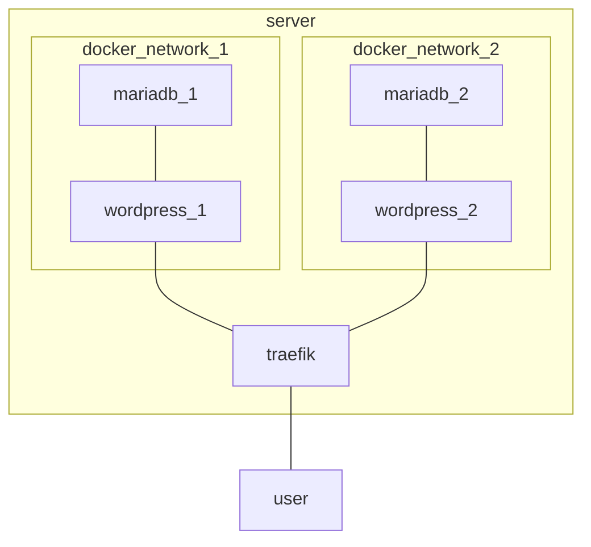

# Présentation
L'objectif est d'avoir une infrastructure minimaliste disposant du maximum de containers WordPress et MariaDB derrière un container reverse-proxy pour exposer des sites en https avec certificat Let's Encrypt à moindre coût.
Cette infrastructure doit répondre au principe de l'IaC et être facilement redéployable, pour migrer (on premise par exemple) ou en cas d'incident, avec le moins d'actions manuelles possibles.

> [!IMPORTANT]
> Ce repository a seulement été testé dans un cadre de PoC sur des serveurs Linux Debian 12 et Alma 8.5 fraîchement installés et en utilisant le compte root.

# Architecture
## Diagramme


## Images docker
**À maintenir à jour**
- traefik:v2.10
- mariadb:11.1.3-jammy
- wordpress:6.4.1
- wordpress:cli

# Exploitation
## Prérequis
- Avoir un serveur sur lequel docker est installé. La procédure officielle se trouve [ici](https://docs.docker.com/engine/install/) et s'effectue en quelques minutes.
- Avoir un enregistement dns pour chaque site que l'on veut déployer.
- Téléchargez le code de ce git.

## Paramétrage
> [!CAUTION]
> Si vous ne suivez pas cette partie, vous vous exposez à d'importants risques de sécurité.

1.  Dans **db1-secret** et **db2-secret**, Modifiez les comptes et mots de passe. Ils servent à accéder aux bases de données de vos sites.
2. Dans **docker-compose.yml**, modifiez votre adresse mail pour savoir si votre certificat arrive à expiration à cette ligne `- "--certificatesresolvers.myresolver.acme.email=exemple@domain.com"`
3. Dans **docker-compose-site1.yml**, modifiez
	- ```- "traefik.http.routers.wordpress-1.rule=Host(`site1.floraud.fr`)"``` : pour mettre votre domaine.
	- ```command: -c 'sleep 40; wp core install --url="site1.floraud.fr" --title="toto" --admin_name=toto --admin_password="toto" --admin_email=toto@toto.com``` : changez avec vos informations.
4. Faire de même avec vos autres sites pour les fichiers **docker-compose-site[x].yml**.

## Déploiement
> [!TIP]
> Vous pourrez boire un café après avoir lancé la commande parce qu'une fois que vous retrouvez la main, il faut compter 40 secondes pour que le serveur WordPress soit préconfiguré par wordpress:cli. C'est le temps nécessaire sur mon serveur pour que MariaDB et WordPress soient fonctionnels et que wordpress:cli fasse son travail. Vous pouvez diminuez le sleep time dans le code ou commentez wordpress:cli pour finir la configuration à la main.

- Dans le dossier, lancez le déploiement des containers à l'aide de `docker compose -f docker-compose.yml -f docker-compose-site1.yml up -d`
- Vous pouvez lancer le site2 à l'aide de `docker compose -f docker-compose-site2.yml up -d`

<details><summary>

# Monitoring
</summary>

- `docker stats` : pour savoir où on en est en terme de ressources. 
- ~~Zabbix~~ : trop gourmand car nécessite une BDD en plus.
- ~~Prometheus~~ : Consomme aussi beaucoup de ressources d'après les retours
- ~~Cadvisor~~ : demande d'être là en live.

</details>

# Troubleshooting
- Vérifiez que les ports 80 et 443 sont bien ouverts sur le firewall du serveur.
- Voir les logs d'un container : `docker logs <name>`
- Contrôler les containers toujours présents : `docker ps`
- Contrôler les volumes toujours présents : `docker volume ls`
- **Attention !** Cette commande est faite pour tout supprimer : `docker compose down --remove-orphans && docker volume prune --all -f && docker network prune -f`
