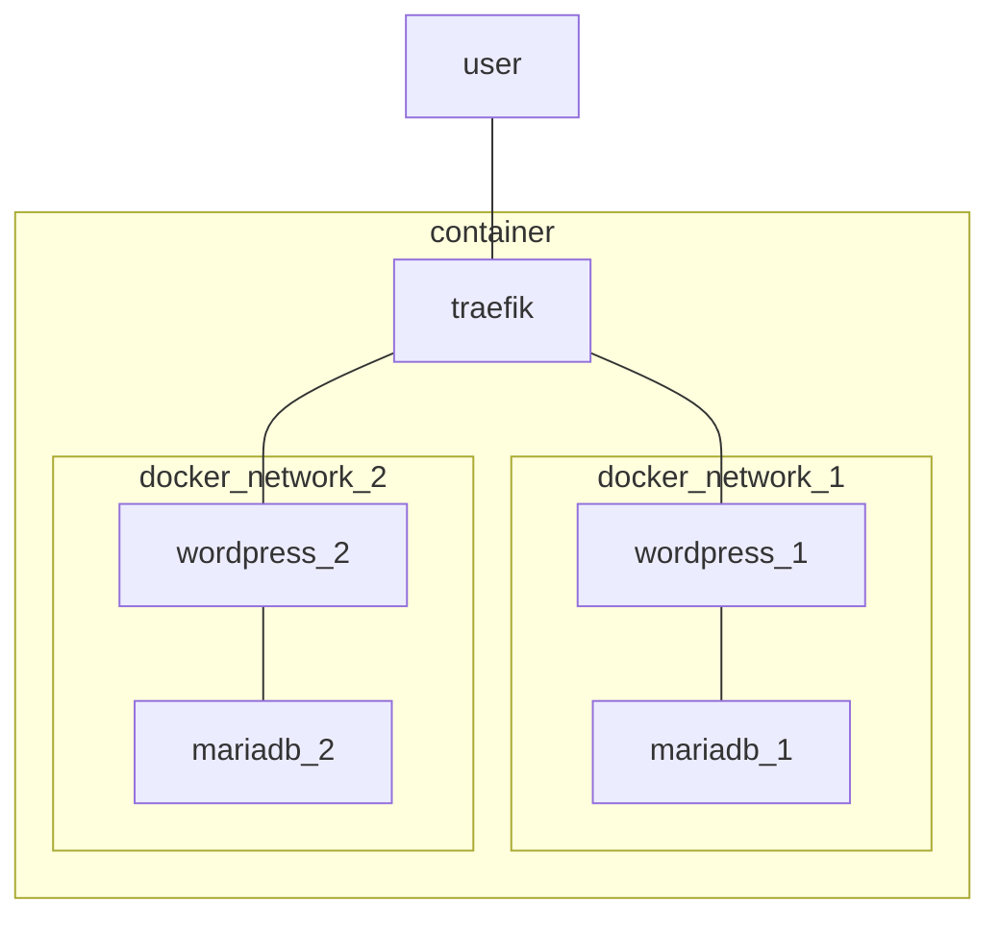

# Présentation
L'objectif est d'avoir une infrastructure minimaliste disposant du maximum de containers wordpress et mariadb derrière un container reverse-proxy pour exposer des sites en https à moindre coût.
Cette infrastructure doit répondre au principe de l'IaC et être facilement redéployable, pour migrer (on premise par exemple) ou en cas d'incident, avec le moins d'actions manuelles possibles.

# To-do list
- [ ] Certbot
	- [ ] enregister le DNS sur mon IP publique juste avant
- [ ] Comment assurer les backups ?
		- Seul les volumes nous intéresse ?
		- Où sont sauvegardés mes thèmes wordpress ?
- [ ] Process de restauration
- [ ] Process d'upgrade
	- suffit-t-il que je mette à jour la version du docker-compose et le relance ?
- [ ] Sécurité
	- [ ] Étudier Docker Bench for Security
	- [ ] Peut-être améliorer la sécurité de traefik car découverte `--providers.docker=true` et il serait peut-être plus pertinent de passer par l'API docker.
- [ ] Déploiement automatique sur une Alma avec Ansible ?
	- [ ] Installer docker
	- [ ] Uploader les fichiers
	- [ ] Créer l'install

# Architecture
## Diagramme

## Images docker
- **Explicitez le numéro de version**

### Reverse Proxy
- Traefik > nginx car le renouvellement de certificat est pensé dans Traefik et que c'est une solution bien adaptée aux containers.

# Administration
## Déploiement
- Lancez le déploiement des containers à l'aide de `sudo docker compose -f docker-compose.yml docker-compose-site1.yml up -d`
- Vous pouvez lancer le site2 à l'aide de `sudo docker compose docker-compose-site2.yml up -d`

# Monitoring

- `docker stats` : pour savoir où on en est en terme de ressources. 
- ~~Zabbix~~ : trop gourmand car nécessite une BDD en plus.
- ~~Prometheus~~ : Consomme aussi beaucoup de ressources d'après les retours
- ~~Cadvisor~~ : demande d'être là en live.

# Troubleshooting
- Voir les logs d'un container : `sudo docker logs <name>`
- Contrôler les containers toujours présents : `sudo docker ps`
- Contrôler les volumes toujours présents : `sudo docker volume ls`
- Relancer les containers : `sudo docker compose up -d`
- **Attention !** Cette commande est faite pour tout supprimer et recréer, containers comme volumes : `sudo docker compose down --remove-orphans && sudo docker volume prune -f && sudo docker network prune -f && sudo docker compose up`
